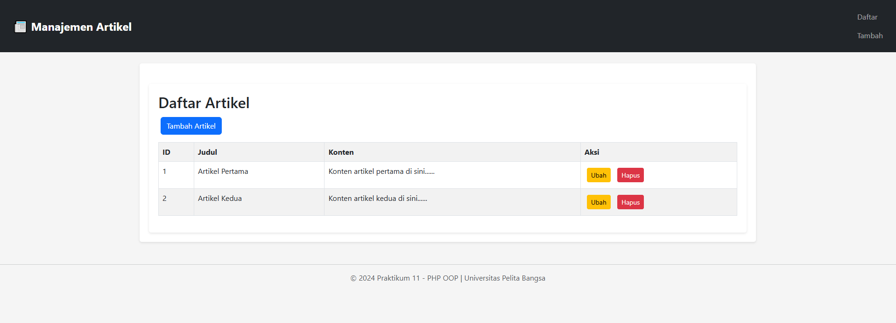
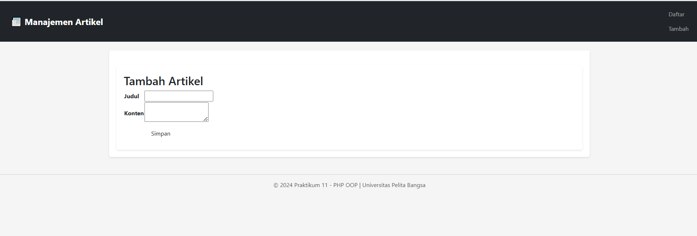
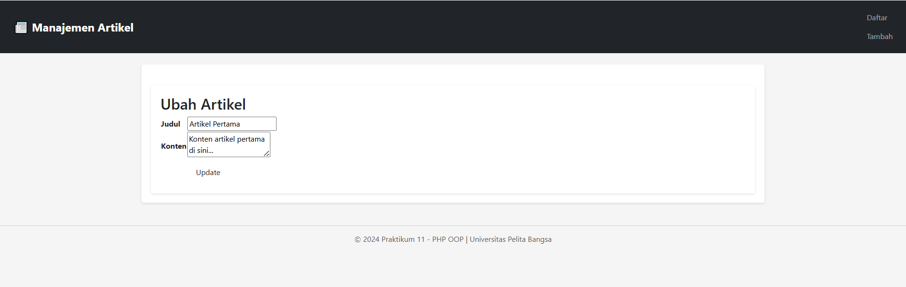
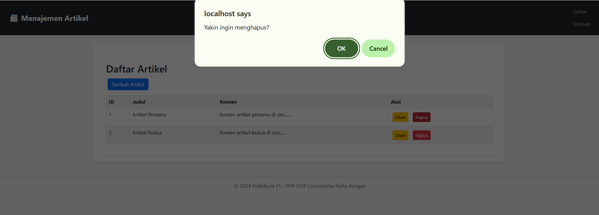

# README Praktikum 11: Front Controller & Modular Architecture

## Identitas Mahasiswa
* **Nama**: Muhammad Aziz Tri Ramadhan

* **NIM**: 312410380

* **Kelas**: TI24A3

* **Dosen**: Agung Nugroho, S.Kom., M.Kom

---

## 1. Deskripsi
Praktikum 11 mengembangkan Praktikum 10 dengan Front Controller Pattern, Modular Architecture, dan URL Routing.

---

## 2. Struktur Direktori
```
lab11_full/
│ index.php
│ config.php
│ .htaccess (opsional)
│
├─ class/
│  ├─ Database.php
│  └─ Form.php
│
├─ module/
│  ├─ home/
│  │  └─ index.php
│  └─ artikel/
│     ├─ index.php
│     ├─ tambah.php
│     ├─ ubah.php
│     └─ hapus.php
│
└─ template/
   ├─ header.php
   └─ footer.php
```

---

## 3. Database Config
```php
$config = [
  'host' => 'localhost',
  'username' => 'root',
  'password' => '',
  'db_name' => 'latihan_oop'
];
```

---

## 4. Class Database.php
```php
class Database {
    public function getAll($table) { /* return array */ }
    public function getById($table, $id_key, $id_value) { /* return 1 record */ }
    public function escape($value) { /* SQL Injection prevention */ }
    public function query($sql) { /* execute */ }
}
```

---

## 📋 5. Class Form.php
```php
$form->addField("judul", "Judul", "text", "");
$form->addField("konten", "Konten", "textarea", "");
$form->render();
```

---

## 6. Front Controller (index.php)
```php
$path = isset($_SERVER['PATH_INFO']) ? $_SERVER['PATH_INFO'] : '/home/index';
$segments = explode('/', trim($path, '/'));
$mod = $segments[0] ?? 'home';
$page = $segments[1] ?? 'index';
$file = "module/{$mod}/{$page}.php";

include "template/header.php";
if (file_exists($file)) include $file;
include "template/footer.php";
```

---

## 7. CRUD Artikel

**index.php** - List
```php
$db = new Database();
$data = $db->getAll('artikel');
// Tampilkan dalam tabel

```
**📸Index (Daftar Artikel)**  
    

**tambah.php** - Add
```php
if(isset($_POST['submit'])){
    $sql = "INSERT INTO artikel (judul,konten) VALUES (...)";
    $db->query($sql);
    header("Location: /lab11_full/artikel/index");
}
```
**📸Tambah (Tambah Artikel)**  
    

**ubah.php** - Edit
```php
$artikel = $db->getById('artikel', 'id', $_GET['id']);
// Update via POST
```
**📸Ubah (Ubah Artikel)**  
    
**hapus.php** - Delete
```php
$db->query("DELETE FROM artikel WHERE id='$_GET[id]'");
header("Location: /lab11_full/artikel/index");
```
**📸Hapus (Daftar Artikel)**  
    
---

## 8. SQL Setup
```sql
CREATE DATABASE latihan_oop;
CREATE TABLE artikel (
    id INT AUTO_INCREMENT PRIMARY KEY,
    judul VARCHAR(255) NOT NULL,
    konten TEXT NOT NULL
);
INSERT INTO artikel VALUES (1, 'Artikel 1', 'Konten 1');
```

---

## 🎨 9. Template
**header.php** - Bootstrap navbar & CSS
📸 *(screenshot)*

**footer.php** - Copyright footer
📸 *(screenshot)*

---

## 10. Cara Jalankan
1. XAMPP running
2. Import SQL database
3. Buka `http://localhost/lab11_full/`
4. Test CRUD


