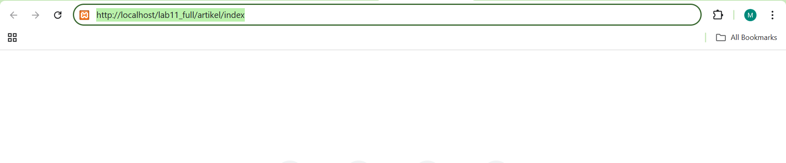
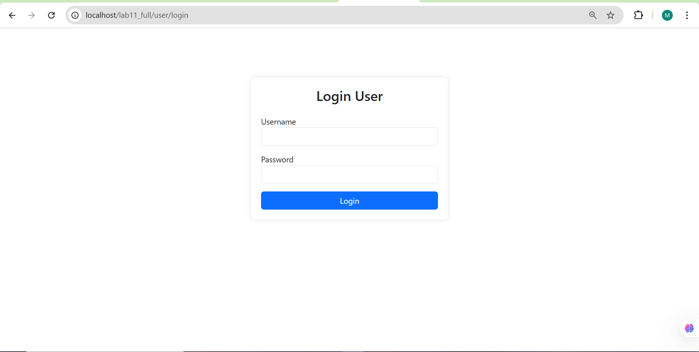
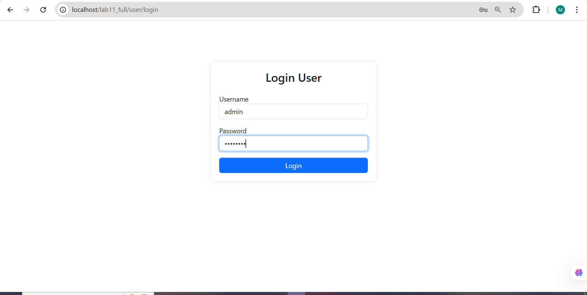
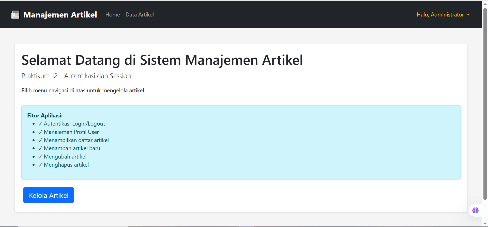
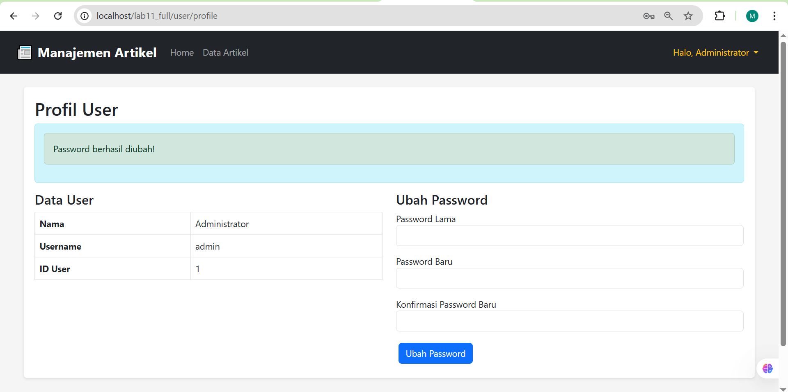


# 🚀 IMPLEMENTASI PHP OOP, ROUTER, DAN AUTENTIKASI AMAN (PRAKTIKUM 11 & 12)

| Detail Akademik | Keterangan |
| --- | --- |
| **Judul Proyek** | Sistem Informasi Manajemen Artikel Berbasis PHP OOP dan Session |
| **Nama Kampus** | UNIVERSITAS PELITA BANGSA |
| **Mata Kuliah** | Pemrograman Web |
| **Dosen Pengampu** | Agung Nugroho, S.Kom., M.Kom |
| **Nama Mahasiswa** | Muhammad Aziz Tri Ramadhan |
| **NIM** | 312410380 |
| **Kelas** | TI.24.A3 |
| **Jurusan** | Teknik Informatika |

---

## 1. 🔍 Arsitektur dan Konfigurasi DasarProyek ini mengadopsi pola **Front Controller (Router)**, di mana semua *request* diproses oleh `index.php`. File-file di *class* (`Database.php`, `Form.php`) berfungsi sebagai **Model** yang mengelola logika bisnis dan data.

### 1.1 Prasyarat Database (`latihan_oop`)Pastikan *database* **`latihan_oop`** sudah memiliki tabel `users` (wajib `VARCHAR(255)` untuk *password*) dan data admin yang sudah di-*hash*:

| Username | Password |
| --- | --- |
| `admin` | `admin123` |

---

## 2. ⚙️ Analisis Kode Program (Per File)

### 2.1. `index.php` (The Router & Session Gatekeeper)File ini adalah **jantung arsitektur** yang menentukan halaman mana yang dimuat dan menerapkan pengamanan sesi.

| Bagian Kode | Penjelasan Teknis & Implementasi P12 |
| --- | --- |
| `session_start();` | **Awal Session.** Wajib dipanggil di awal *router* agar `$_SESSION` tersedia di seluruh aplikasi. |
| **Session Gatekeeper** | `php $public_pages = ['home', 'user']; if (!in_array($mod, $public_pages)) { ... if (!isset($_SESSION['is_login'])) { header('Location: /lab11_full/user/login'); exit(); } } ` |

> 📸 **Halaman Login**

### 2.2. `class/Database.php` (Model OOP)File ini diubah total dari praktikum sebelumnya untuk mendukung Autentikasi dan *update* data user.

| Kode Baru/Perbaikan | Fungsi & Keterkaitan P12 |
| --- | --- |
| `public function getUserByUsername($username)` | **Wajib untuk Login.** Ini mempermudah `login.php` untuk mengambil satu baris data user berdasarkan *username* sebelum memverifikasi *password*. |
| `public function updateUser($id, $data)` | **Wajib untuk Profil.** Ini adalah *method* yang aman dan terstruktur untuk menjalankan *query* `UPDATE users SET password='hash_baru' WHERE id='user_id'`. Digunakan oleh `profile.php`. |
| `public function escape($value)` | **Keamanan Dasar.** Menggunakan `real_escape_string` untuk mencegah SQL Injection pada semua input data. |

### 2.3. `module/user/login.php` (Inti Autentikasi)File ini memproses kredensial dan memulai sesi yang benar.

| Kode Kritis | Fungsi & Keterkaitan P12 |
| --- | --- |
| `if ($data && password_verify($password, $data['password']))` | **Verifikasi Password Aman.** Menggunakan fungsi PHP `password_verify()` untuk membandingkan *password* masukan dengan *hash* yang tersimpan di DB. Ini adalah standar keamanan. |
| **`$_SESSION['user_id'] = $data['id'];`** | **Penyimpanan Kunci.** Variabel `user_id` ini *mutlak* diperlukan oleh halaman `profile.php` untuk mengetahui *user* mana yang harus di-*update* data *password*-nya. |
| `header('Location: /lab11_full/artikel/index');` | Redirect ke halaman artikel setelah sukses *login*. |

> 📸 **Login**

 📸 **Masuk Ke Halaman Home Page (index)**

### 2.4. `module/user/logout.php`| Kode Perbaikan | Fungsi & Keterkaitan P12 |
| --- | --- |
| `session_start();` | **Perbaikan Error.** Meskipun `index.php` sudah memanggilnya, ini memastikan sesi diinisialisasi, menghindari *error* *Trying to destroy uninitialized session* saat diakses langsung. |
| `session_destroy();` | **Penghapusan Session.** Menghapus semua data sesi. |

### 2.5. `module/user/profile.php` (Tugas Final Praktikum)Ini adalah implementasi fitur profil dan perubahan *password* yang aman.

| Logika Kritis | Fungsi & Keterkaitan P12 |
| --- | --- |
| **`$user_id = $_SESSION['user_id'];`** | **Identifikasi User.** Mengambil ID yang aman dari sesi. Tanpa ID ini, fitur profil tidak akan berfungsi dengan benar. |
| `elseif (!password_verify($current_password, $current_user_data['password']))` | **Verifikasi Password Lama.** Blok ini memastikan *user* memasukkan *password* lama yang benar sebelum diizinkan mengubah. |
| `$hashed_new_password = password_hash($new_password, PASSWORD_DEFAULT);` | **Enkripsi Wajib.** Ini adalah bagian terpenting dari P12. *Password* baru di-*hash* sebelum disimpan, menjamin *password* tidak disimpan sebagai *plaintext* di DB. |
| `$db->updateUser($user_id, $update_data)` | Memanggil *method* OOP di `Database.php` untuk mengeksekusi *update* yang aman. |

> 📸 **Profil View:**

> 📸 **Password Berhasil Diubah:**

### 2.6. `template/header.php` (Navigasi Dinamis dan Estetik)File ini mengatur tampilan *navbar* berdasarkan status sesi.

| Logika Tampilan P12 | Fungsi |
| --- | --- |
| `php if (isset($_SESSION['is_login'])): ?> ... else: ... endif; ` | **Navigasi Kondisional.** Menampilkan link `Data Artikel`, `Profil`, dan `Logout` hanya ketika `$_SESSION['is_login']` aktif, dan menampilkan `Login` ketika sesi tidak ada. |
| `<a class="dropdown-item" href="/lab11_full/user/profile">👤 Profil</a>` | Implementasi link *dropdown* yang elegan untuk mengakses halaman **Tugas P12**. |

### 2.7. Modul CRUD (`module/artikel/tambah.php`, `ubah.php`, `hapus.php`)* **Evaluasi:** Semua file CRUD ini kini **otomatis terlindungi** karena `index.php` (Router) sudah menerapkan *Session Gatekeeper*. Logika CRUD di dalamnya sudah benar menggunakan `$db->escape()` untuk keamanan input.

---

## 3. 📝 Panduan Uji Coba untuk Laporan1. Akses: Coba URL **`http://localhost/lab11_full/artikel/tambah`**. (Harus *redirect* ke *login*). **(Ambil Screenshot #1)**.
2. Login: Masuk dengan `admin` / `admin123`. **(Ambil Screenshot #2)**.
3. Profil: Akses **`/user/profile`**. Lihat data user. **(Ambil Screenshot #3)**.
4. Ubah Password: Isi form, submit, dan pastikan muncul pesan sukses. **(Ambil Screenshot #4)**.
5. Uji Password Baru: *Logout* dan coba *login* lagi menggunakan *password* yang baru.
6. CRUD: Coba Tambah, Ubah, Hapus Artikel.
